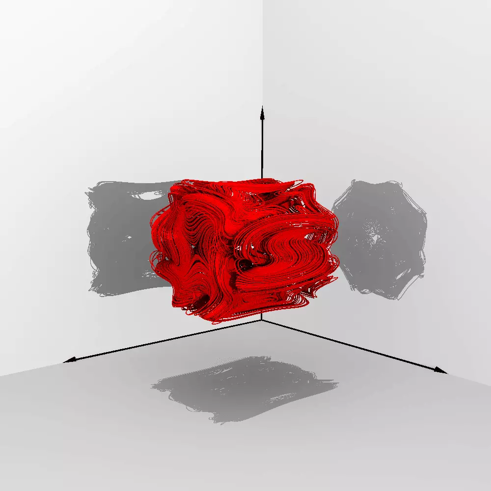

# Cyclic Multi-valued Transformation Method
A cyclic multi-valued transformation method (CMVTM) for designing multi-fold chaotic/hyperchaotic system from scroll/wing-type seed system.

## Description
By selecting two simple chaotic and hyperchaotic systems with no equilibrium point as the seeds, the application of the CMVTM yields hidden chaotic and hyperchaotic oscillations with multi-fold trajectories. 

## Simulation
The 3-D phase portraits of the multi-fold systems with different semi-axis parameters: (a) 3-D $x_1-x_2-x_3$ space phase portrait generated by 3-D Chaotic system; (b) 3-D $x_1-x_2-x_3$ space phase portrait generated by 4-D Hyperchaotic system; (c) 3-D $x_3-x_4-x_1$ space phase portrait generated by 4-D Hyperchaotic system
| (a)                     | (b)                   | (c)                   |
| ----------------------- | --------------------- | --------------------- |
|  |  |  |

## Keywords
- Chaotic system
- Hyperchaotic system
- Fractal
- Multi-fold system
- Hidden attractor  

